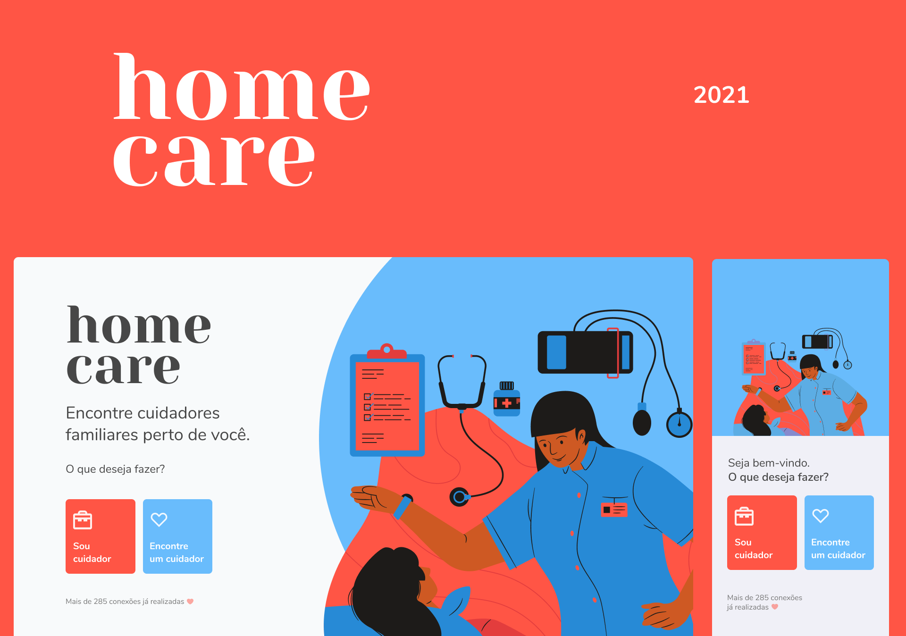

<h1 align="center">
 
</h1>

<p align="center">
  
  
  
  
  <a href="https://github.com/amanda-santos/homecare/commits/master">
    
  </a>
  
  <a href="https://github.com/amanda-santos/homecare/issues">
    
  </a>
  
  
</p>

<p align="center">
  <a href="#-about-the-project">About the project</a>&nbsp;&nbsp;&nbsp;|&nbsp;&nbsp;&nbsp;
  <a href="#-technologies">Technologies</a>&nbsp;&nbsp;&nbsp;|&nbsp;&nbsp;&nbsp;
  <a href="#-getting-started">Getting started</a>&nbsp;&nbsp;&nbsp;|&nbsp;&nbsp;&nbsp;
  <a href="#-how-to-contribute">How to contribute</a>&nbsp;&nbsp;&nbsp;|&nbsp;&nbsp;&nbsp;
  <a href="#-license">License</a>
</p>

## 📝 About the project

<p>📚 homecare is...</p>

## 👩🏻‍💻 Technologies

Technologies used to develop this project:

- NestJS
- TypeORM
- Next.js
- React Native
- Expo
- TypeScript
- MySQL

## ⌨ Getting started

Running the backend:

- Inside the backend folder, run `npm i` or `yarn` to install the dependencies
- Change `ormconfig.json`, adding the setup of your MySQL database
- Build with `npm run build` or `yarn build`
- Run the server with `npm start` or `yarn start`

Running the frontend (mobile):

- Inside the frontend folder, run `npm i` or `yarn` to install the dependencies
- Run with `expo start`

## 🖥 Preview

📖

## 🤔 How to contribute

**Make a fork of this repository**

```bash
# Fork using GitHub official command line
# If you don't have the GitHub CLI, use the web site to do that.

$ gh repo fork amanda-santos/homecare
```

**Follow the steps below**

```bash
# Clone your fork
$ git clone your-fork-url && cd homecare

# Create a branch with your feature
$ git checkout -b my-feature

# Make the commit with your changes
$ git commit -m 'feat: My new feature'

# Send the code to your remote branch
$ git push origin my-feature
```

After your pull request is merged, you can delete your branch

## 📝 License

This project is licensed under the MIT License - see the [LICENSE](LICENSE) file for details.

---

Made with ❤ by Amanda Santos <br />
